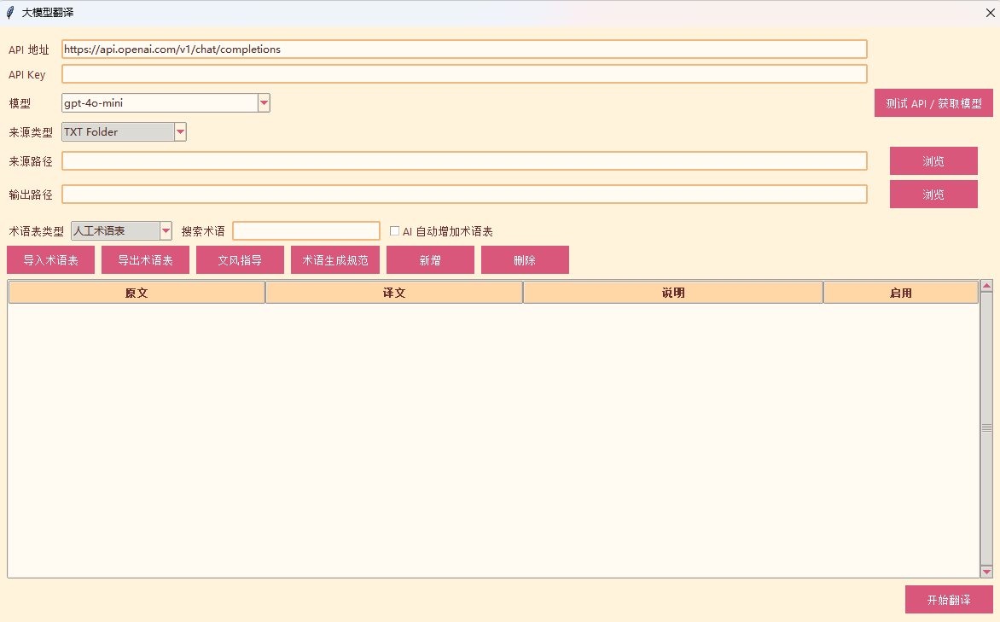

# Nibble

Nibble 是一个面向网络小说的本地桌面工具，集成小说抓取、TXT 转 EPUB、大模型翻译、术语表管理和翻译进度控制。项目目前以 Windows 桌面使用为主，界面默认中文，也可以在设置中切换为英文。

> 本项目仅用于个人学习、备份和阅读场景。请遵守目标网站的服务条款和当地法律法规，不要用于侵犯版权或绕过付费内容。

## 截图




## 2.7 版更新内容

本次更新重点重做了“翻译润色”工作流：

- 润色时分别选择“原文目录”和“译文目录”，程序会按照完全相同的 TXT 文件名自动配对。
- 开始前会检查所有译文是否存在同名原文，缺少配对时直接提示，不会在没有原文的情况下继续润色。
- 如果译文目录中存在 `_machine_glossary.json` 或 `_manual_glossary.json`，程序会自动读取；两者都不是必需文件。
- 人工术语表中的同名术语优先于机器术语表，同时支持追加导入其他 JSON 术语表。
- 润色流程调整为：术语校对 → 符号与排版对照 → 自然润色。
- 三个阶段都可以单独设置是否分段，以及每段包含多少行。
- 默认只有“自然润色”启用分段，每段 80 行；术语校对和符号对照默认整章处理。
- 新增可编辑的润色指导，默认要求对照原文和粗译文，补足必要的主谓宾，使中文表达自然且逻辑清楚。
- 输出目录会自动设置为译文目录同级的“原译文目录名_polished”文件夹。
- 已经生成且非空的润色 TXT 会自动跳过，任务中断后可以直接继续运行。
- Novelpia 登录资料目录支持自动寻找：Nibble 会定位本机 Chrome 用户数据目录，并在 Chrome 目录下创建独立的 Nibble 登录资料。
- 设置窗口新增“自动寻找”按钮，同时保留手动选择目录的功能。

## 主要功能

- 桌面窗口界面，不再依赖终端菜单操作。
- 支持中文 / 英文界面，默认中文。
- 支持抓取已适配站点的小说目录和章节内容。
- 支持将 TXT 章节文件夹转换为 EPUB。
- 支持抓取完成后直接生成 EPUB。
- 支持通过 OpenAI 兼容接口调用大模型翻译。
- 支持 TXT 文件夹和 EPUB 两种翻译来源。
- 支持配置 API 地址、API Key，并测试接口获取模型列表。
- 支持文风指导，用于控制 AI 翻译风格。
- 支持自定义 AI 术语生成规范，用于控制机器术语表提取范围。
- 支持人工术语表导入、导出、搜索、编辑。
- 支持 AI 自动增加机器术语表，并自动保存。
- 支持原文与译文对照的批量翻译润色。
- 支持术语校对、符号对照、自然润色三个独立阶段。
- 支持为每个润色阶段单独配置分段和每段行数。
- 翻译时可查看当前术语表，双击术语即可编辑。
- 支持翻译进度条、总耗时、平均每章耗时、暂停、继续和结束翻译。
- 支持使用 `Nibble_background.jpg` 作为程序背景图。

## 环境要求

- Windows 10 / Windows 11
- Python 3.10 或更高版本
- Google Chrome 115 或更高版本，建议使用最新版
- 程序会优先使用 Selenium Manager 自动匹配 ChromeDriver；如自动匹配失败，可使用程序内的重置 / 自动下载逻辑，或手动配置与本机 Chrome 主版本一致的 ChromeDriver

ChromeDriver 不需要固定为某一个版本。它只需要和用户电脑上的 Chrome 主版本匹配，例如 Chrome 138 通常应搭配 ChromeDriver 138。项目内如附带 `chromedriver.exe`，它只是离线兜底，不代表程序只能兼容该版本。

建议使用普通 Python 环境运行。若之后需要打包为 exe，可以使用项目内的 `build_windows.ps1` 生成 Windows 便携版。

## 安装

### 直接使用打包版

如果拿到的是 `Nibble-2.7-Windows-x64.zip`：

1. 将 ZIP 完整解压到一个普通文件夹，不要直接在压缩包里运行。
2. 双击 `Nibble.exe`。
3. 第一次使用大模型功能时，填写 API 地址、API Key，并点击“测试 API / 获取模型”。
4. 抓取网页小说时，电脑仍需安装 Google Chrome。

打包版不需要安装 Python。不要只复制单独的 `Nibble.exe`，必须保留 `_internal` 等同目录文件。

### 从源码运行

进入项目目录后安装依赖：

```bash
pip install -r requirements.txt
```

如果你的系统里同时有多个 Python 版本，可以使用：

```bash
python -m pip install -r requirements.txt
```

## 启动

默认启动桌面界面：

```bash
python Nibble.py
```

如果需要进入旧版终端模式：

```bash
python Nibble.py --cli
```

主程序入口为 `Nibble.py`。

## 基本使用

### 抓取小说

1. 在主界面的“小说网址”输入框中输入小说目录页 URL。
2. 点击“抓取小说”。
3. 程序会启动浏览器并尝试读取目录、抓取章节。
4. 抓取结果会保存为 TXT 文件，并按配置生成 EPUB。

目前项目中重点适配了 `Novelpia` 和 `sbxh4.com` 这一类页面，例如：

```text
https://novelpia.com/novel/416423
https://sbxh4.com/novel/26305
```

其他站点是否可用，取决于项目里已有的站点处理器。

#### Novelpia 网页模式

Novelpia 使用可见 Chrome 和独立的持久浏览器资料目录，不保存账号密码或手工复制的 `LOGINKEY`：

1. Nibble 会自动寻找本机 Chrome 的用户数据位置，并在 Chrome 目录下生成独立的 Novelpia 登录资料目录。
2. 如需重新检测，可打开“设置”，在“Novelpia 资料目录”右侧点击“自动寻找”；仍可用“浏览”手动指定其他目录。
3. 在主界面的 “Novelpia 登录” 区域点击 “打开登录窗口”。
4. Nibble 会用同一个独立资料目录启动普通 Chrome，而不是 WebDriver 浏览器；请在这个窗口里正常登录。
5. 验证码、实名和订阅确认都由用户在网页中完成；登录完成后关闭这个 Chrome 窗口，再回到 Nibble 点确定。
6. 之后可点击 “检测登录状态” 确认是否保存成功。
7. 输入 `https://novelpia.com/novel/作品编号` 并点击“抓取小说”，填写 `1-50` 这样的章节范围；留空表示全部。
8. 程序通过作品页自己的分页控件读取章节，再逐章打开正常阅读页，从已经渲染的 `#novel_text` 保存正文。

该模式固定为单标签页、单线程，每章默认随机等待 4–7 秒；已存在且非空的 TXT 会自动跳过，因此中断后可以直接重新运行续抓。遇到登录页、权限页、验证码或正文未加载时会在首个失败章节停止，不会反复重试，也不会绕过付费、实名或验证码。

Windows 下会优先自动定位 `%LOCALAPPDATA%\Google\Chrome\User Data`，并将 Nibble 的独立登录状态保存到 `%LOCALAPPDATA%\Google\Chrome\Nibble\novelpia_chrome_profile`。Chrome Beta、Chrome Canary、macOS 和 Linux 也会检查各自的常见用户数据位置。

这里不会直接复用普通 Chrome 的 `Default` 或 `Profile 1`，因此不会和你正在使用的 Chrome 争抢资料锁。普通 Chrome 里登录不等于 Nibble 已登录，首次使用自动目录时需要在 Nibble 打开的窗口中登录一次。旧版本的 `%LOCALAPPDATA%\Nibble\novelpia_chrome_profile` 不会被删除；如需继续使用旧登录状态，可在设置中手动选择旧目录。

请不要同时打开两个使用同一资料目录的 Nibble 抓取任务。若需要调整资料目录或间隔，可在 GUI 设置里修改，或在 `config.json` 中设置：

```json
{
  "novelpia_profile_dir": "",
  "novelpia_delay_min": 4.0,
  "novelpia_delay_max": 7.0
}
```

### TXT 文件夹转 EPUB

1. 点击“TXT 文件夹转 EPUB”。
2. 选择包含章节 TXT 的文件夹。
3. 程序会根据章节文件名排序并生成 EPUB。

### 大模型翻译

1. 点击“大模型翻译”。
2. 填写 API 地址、API Key。
3. 点击“测试 API / 获取模型”，成功后选择模型。
4. 选择来源类型：TXT 文件夹或 EPUB。
5. 选择来源路径和输出路径。
6. 如有需要，导入人工术语表或开启“AI 自动增加术语表”。
7. 点击“开始翻译”。

翻译过程中可以：

- 查看日志。
- 查看进度条。
- 查看当前章节、总耗时、平均每章耗时。
- 暂停 / 继续翻译。
- 请求结束翻译。
- 在主窗口下方查看当前术语表。
- 双击术语直接编辑。

结束翻译并不会强行中断已经发出的 API 请求，而是在当前 API 调用结束后停止，这是为了避免输出文件损坏。

### 翻译润色

润色功能用于把已有原文和粗译文进行批量对照校正。开始前请准备两个文件夹：

```text
原文目录
├─ 001 - 第一章.txt
├─ 002 - 第二章.txt
└─ 003 - 第三章.txt

译文目录
├─ 001 - 第一章.txt
├─ 002 - 第二章.txt
├─ 003 - 第三章.txt
├─ _machine_glossary.json（可选）
└─ _manual_glossary.json（可选）
```

两个目录中的章节 TXT 文件名必须完全相同。机器术语表和人工术语表都可以没有；没有术语表时，程序会使用空术语表继续执行符号对照和自然润色。

使用步骤：

1. 在主界面点击“翻译润色”。
2. 填写 API 地址和 API Key，测试接口后选择模型。
3. 选择原文目录。
4. 选择译文目录。
5. 程序会自动显示译文目录内检测到的机器术语表和人工术语表；未检测到时会显示提示，但不会阻止润色。
6. 如需使用其他术语表，点击“导入追加术语表”；追加术语只补充缺少的条目，不覆盖人工术语。
7. 检查自动生成的输出目录。默认示例：

```text
作品_translated
作品_translated_polished
```

8. 根据需要配置三个阶段：

   - 自然润色：默认启用分段，每段 80 行。
   - 术语校对：默认不分段，即整章处理。
   - 符号对照：默认不分段，即整章处理。

9. 在“润色指导”中填写具体要求，或直接使用默认指导。
10. 点击“开始润色”。

实际处理顺序如下：

1. 对照原文和术语表，统一人名、组织名、技能名及其他专有名词。
2. 对照原文修正引号、括号、省略号、破折号、分隔符、消息标记及段落结构。
3. 按润色指导优化中文表达，补足必要的主语、谓语或宾语，同时保持原意、语气和术语不变。

如果译文目录中存在找不到同名原文的 TXT，程序会列出文件名并停止。输出目录不能与译文目录相同，以免覆盖粗译文。

## API 地址说明

Nibble 使用 OpenAI 兼容的 Chat Completions 接口。常见填写方式示例：

```text
https://api.openai.com/v1
https://api.openai.com/v1/chat/completions
https://api.deepseek.com/v1
```

如果接口测试失败，通常需要检查：

- API 地址是否包含正确的 `/v1`。
- API Key 是否有效。
- 当前服务商是否支持 `/models` 模型列表接口。
- 网络是否能访问该 API 服务。
- 账户是否有可用额度。

## 术语表

Nibble 支持两类术语表：

- 人工术语表：由用户导入、手动新增和编辑。
- 机器术语表：由 AI 在翻译章节后自动提取并保存。

术语表会影响后续章节翻译，使角色名、专有名词、游戏术语、行业术语等保持一致。

支持的术语项字段：

```json
{
  "src": "原文术语",
  "dst": "目标译文",
  "info": "说明或分类",
  "lock": 0,
  "is_active": 1
}
```

机器术语表保存位置：

- TXT 文件夹翻译：输出目录下的 `_machine_glossary.json`
- EPUB 翻译：输出 EPUB 同名的 `*_machine_glossary.json`

## 文风指导

点击“大模型翻译”窗口中的“文风指导”，可以填写你希望 AI 遵守的翻译风格，例如：

```text
请翻译为自然流畅的简体中文，保留轻小说口吻。
角色对白要口语化，叙述部分保持清晰，不要过度文言化。
专有名词必须优先遵守术语表。
```

保存后，后续翻译会自动带上这段指导。

## 术语生成规范

点击“大模型翻译”窗口中的“术语生成规范”，可以修改 AI 自动提取机器术语表时遵守的规则。比如可以要求 AI 更关注角色名、游戏技能、组织名，也可以限制它不要收录普通词语。

保存后，开启“AI 自动增加术语表”时会自动使用这份规范。

## 背景图

主界面会自动读取项目根目录下的 `Nibble_background.jpg` 作为背景图。图片会按窗口大小自适应铺满，并叠加一层暖色透明遮罩，使按钮和文字更容易阅读。

## 配置文件

项目会使用 `config.json` 保存本地设置，例如：

- ChromeDriver 路径
- 下载格式
- 界面语言
- API 地址
- 模型名
- 文风指导
- 术语生成规范
- 上次打开的翻译来源和输出路径
- Novelpia 独立浏览器资料目录和抓取间隔

如果配置混乱，可以在程序中点击“重置 ChromeDriver”，或手动检查 `config.json`。

## 打包说明

推荐先打包为 Windows 便携版。便携版不需要用户安装 Python，用户解压后双击 `Nibble.exe` 即可运行。

项目已经提供 `build_windows.ps1`，可以直接用于打包。脚本会自动执行以下步骤：

- 安装 `requirements.txt` 中的运行依赖。
- 安装 PyInstaller。
- 清理旧的 `build` 和 `dist` 目录。
- 调用 PyInstaller 生成 `dist\Nibble` 便携目录。
- 复制 `README.md`、`LICENSE` 和 `config.example.json` 到分发目录。
- 如果项目根目录存在 `chromedriver.exe`，会把它一起放进分发包作为离线兜底。

### 构建便携版

在项目根目录打开 PowerShell，运行：

```powershell
.\build_windows.ps1
```

如果 PowerShell 阻止脚本运行，可以在当前窗口临时放宽执行策略后再运行：

```powershell
Set-ExecutionPolicy -Scope Process -ExecutionPolicy Bypass
.\build_windows.ps1
```

构建完成后会生成：

```text
dist\Nibble\Nibble.exe
```

把整个 `dist\Nibble` 文件夹压缩后发给别人即可。不要只发送单独的 `Nibble.exe`，因为同目录还包含运行所需的资源文件和依赖目录。

### 分发前建议

- 不要把你自己的 `config.json` 放进分发包，里面可能包含 API Key 和本机路径。
- 可以保留 `config.example.json`，用户需要时可参考它。
- 保留 `Nibble_background.jpg`，程序会把它作为背景图使用。
- 如果包内包含 `chromedriver.exe`，它会作为离线兜底；程序仍会优先尝试自动匹配用户本机 Chrome 对应的 ChromeDriver。
- 用户电脑仍然需要安装 Google Chrome。
- 用户 Chrome 版本过旧时，建议先升级 Chrome。Chrome 115 以下版本的驱动下载和自动匹配不如新版稳定。
- 如果杀毒软件误报，可以尝试使用 `--onedir` 便携目录分发，而不是单文件 exe。

### 做安装程序

如果之后想做真正的安装包，可以先用 `build_windows.ps1` 生成 `dist\Nibble`，再用 Inno Setup 或 NSIS 把这个文件夹打成安装程序。安装程序本质上只是把便携版复制到用户电脑，并创建桌面快捷方式。

## 常见问题

### 为什么结束翻译不是立刻停止？

因为当前 API 请求已经发出，程序会等待这次请求返回后再停止。这样可以减少半章输出、空文件或 EPUB 损坏的概率。

### 为什么机器术语表不是实时逐句更新？

机器术语表是在每章翻译完成后，由 AI 根据原文和译文提取新增术语。因此它通常会按章节批量更新。

### 为什么有些网站抓不到？

不同网站结构和反爬机制不同。Nibble 只能稳定处理已经适配过的站点。遇到新站点时，通常需要新增对应的目录解析和正文提取逻辑。

## License

本项目使用 MIT License，详见 [LICENSE](LICENSE)。

项目中包含基于早期 MIT 许可项目演进而来的代码，原始版权声明见 [NOTICE](NOTICE)。
